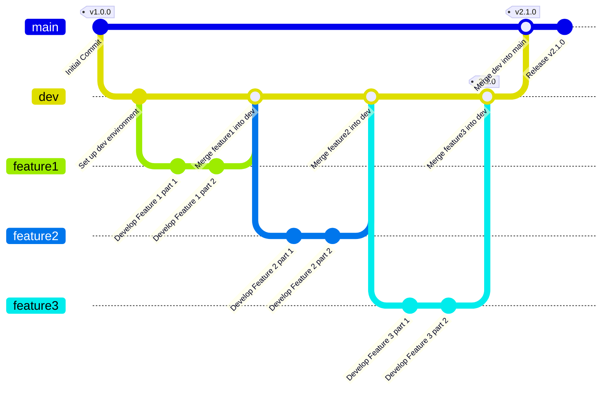

# Contributing to Secured Whisker

Thank you for your interest in contributing to Secured Whisker! This document explains how to contribute effectively and respectfully.

## General Rules

- Open an issue first to discuss a significant new feature or architecture change.
- Respect the project's [Code of Conduct](CODE_OF_CONDUCT.md) and remain courteous.

## Workflow

1. Fork the repository and create a branch on your fork: `feature/your-feature` or `fix/brief-description`.
2. Work locally and write clear, atomic commits.
3. Open a Pull Request (PR) against the `dev` branch of the main repository.
4. Wait for reviews: a maintainer may request changes before merging.


## Git flow

When I release version 1.0.0, Git Flow should look like this. 



## Commit messages

Use conventional commits, for example:

| Type | Description |
|------|-------------|
| feat | A new feature |
| fix | A bug fix or design correction |
| docs | Documentation added or updated |
| refactor | Code change that is not a feature or a bug fix |
| perf | Code change that improves performance |
| test | Adding or updating tests |
| chore | Changes to build process or auxiliary tools (docs generation, CSS minification, etc.) |

<small>If you don't have access to an AI assistant, you can use [Diny](https://github.com/dinoDanic/diny) as a helper.</small>

## Versioning

This project follows [Semantic Versioning 2.0.0](https://semver.org/).

Given a version number MAJOR.MINOR.PATCH, increment the:

- **MAJOR** version when you make incompatible API changes
- **MINOR** version when you add functionality in a backward compatible manner
- **PATCH** version when you make backward compatible bug fixes

Additional labels for pre-release and build metadata are supported as extensions to the MAJOR.MINOR.PATCH format.

## Code Quality

- Follow the style rules of the subproject (PHP-CS-Fixer / ESLint, etc.).
- Add tests for new features (unit/integration) when feasible.
- Document important changes in the `README` or `docs/`.

## Security

If you discover a security vulnerability, do not disclose details publicly. Report it following the process described in [SECURITY.md](./SECURITY.md).

## Quickstart (local development)

1. Clone the repository

```bash
git clone --recurse-submodules https://github.com/YR72dpi/SecuredWhisker.git
cd SecuredWhisker
```

2. Build and run with Docker Compose (development)

```bash
docker compose -f docker-compose.dev.yml up --build -d
```

Documentation & resources

- [📜 Changelog](./docs/changelog.md)
- [🧭 Q&A Policy](./docs/Q&A_POLICY.md)
- [🔐 Security Policy](./SECURITY.md)
- [🏗️ Technical Architecture](./ARCHITECTURE.md)
- [⚙ How it works](./docs/HOW_IT_WORKS.md)

For contributors

See [CONTRIBUTING.md](./CONTRIBUTING.md) for contribution guidelines, [ARCHITECTURE.md](./ARCHITECTURE.md) for repository structure, and [SECURITY.md](./SECURITY.md) for responsible disclosure instructions.

License

This project is distributed under the MIT License — see `LICENSE`.

Contact

If you have questions open an issue or contact the maintainer on GitHub.


Thank you — your contributions make this project better.