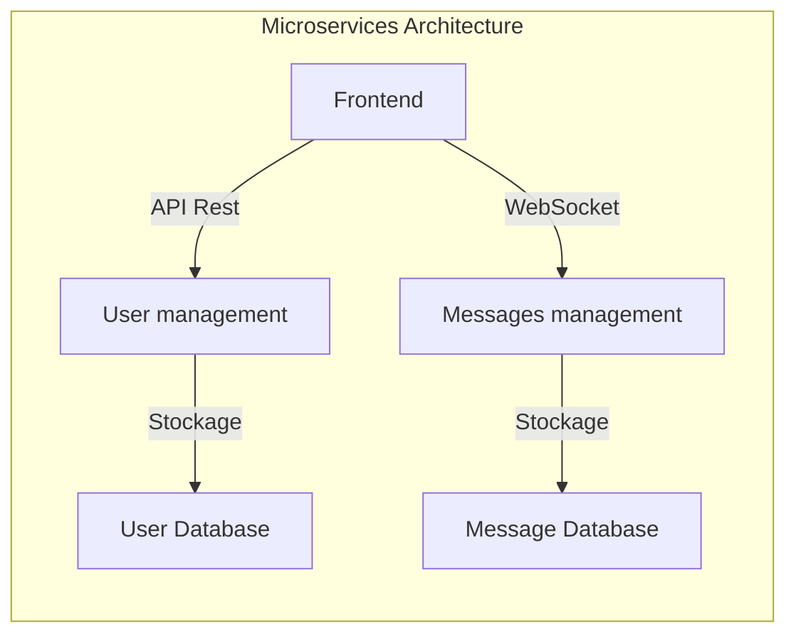
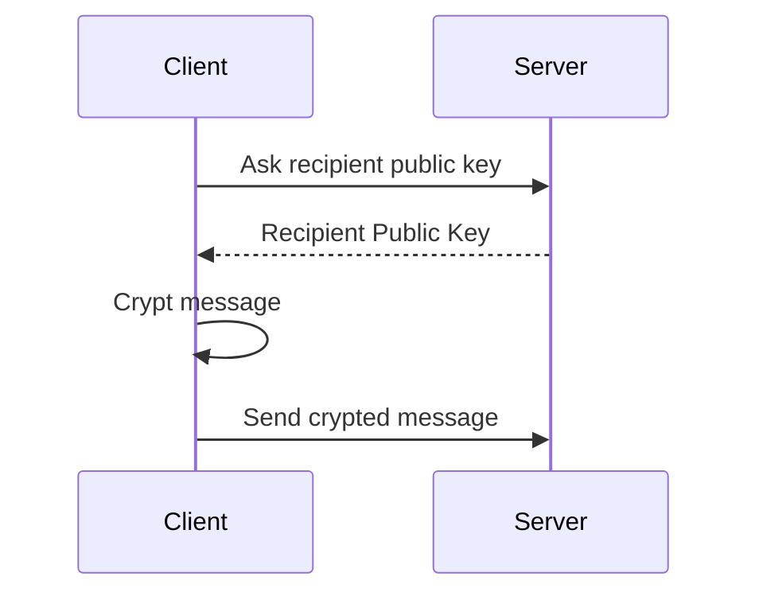
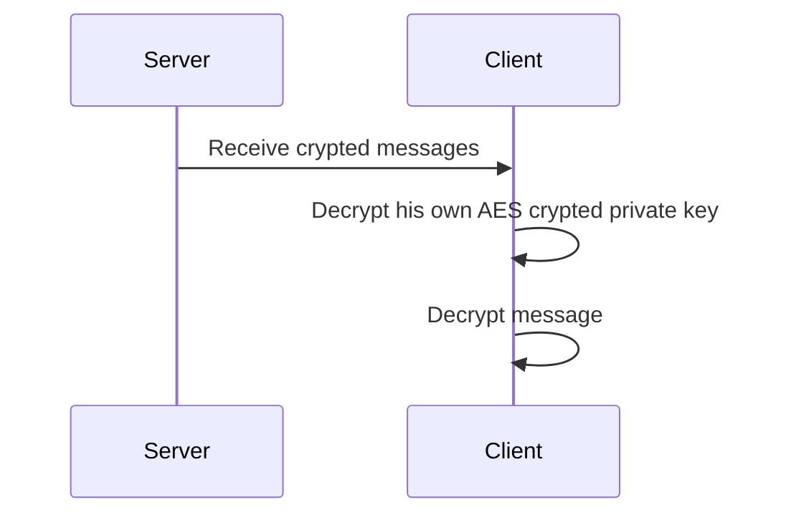

---

# Secured Whisker 2.0

This is a secure messaging application that allows users to send encrypted messages to each other using RSA encryption. The application ensures the security and privacy of communication by encrypting messages before transmission and decrypting them upon reception.

## ⚠ Warning ⚠

// To complete...

## Features

- Login
- Sign up
- Add someone
- Send / receive message

## How to Run

// To complete...

## Architecture

## Stack

- User management
    - Langage: __PHP__
    - Framework: __Symfony__
    - ORM: __Doctrine__
    - Database: __PostgreSQL__

- Messages management
    - Langage: __GO__
    - Framework: __Fiber__
    - WebSocket: __Gorilla WebSocket__
    - ORM: __Go Redis__
    - Database: __Redis__

- Frontend
    - Langage: __TypeScript__
    - Framework: __NextJs__
    - WebSockets : __socket.io__
    - Encryption: __JSEncrypt__ 🚨
    - Saving on client : __Dexie.js__ (library for indexedDB )

All of that are Docker-_ized_

## How it works

### Sign up

On subscription form, enter ip, port, pseudo and password.

The password will be used to encrypt the private key in AES.

A tag will be generate like __pseudo#randomNumber__ like Discord

### Login

On login form, enter ip, port, pseudo, password.

You have to remember all of these information.

### Sending Message

### Receive Message

## Configuration

// To complete...

## Contributing

Contributions are welcome! Feel free to open issues or submit pull requests to contribute to the development of this application.

## To improve it

- create groups
- exchange files
- react-native front
