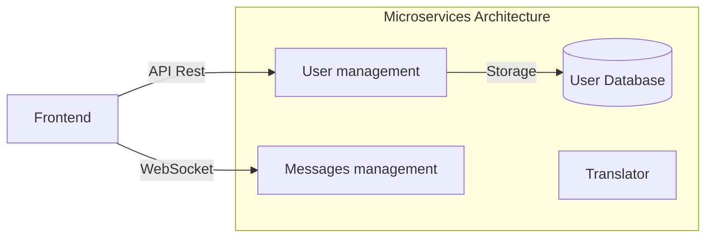
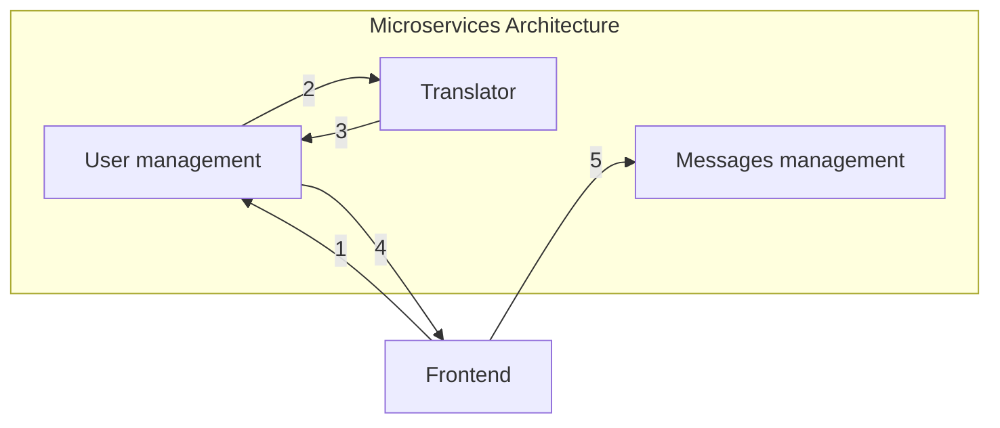
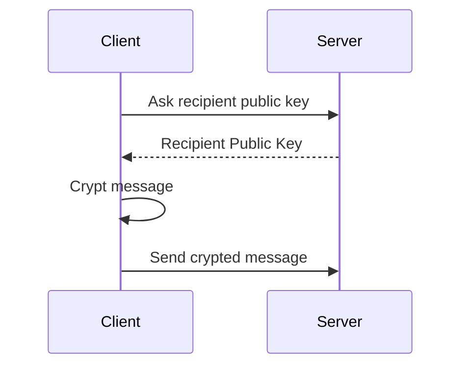
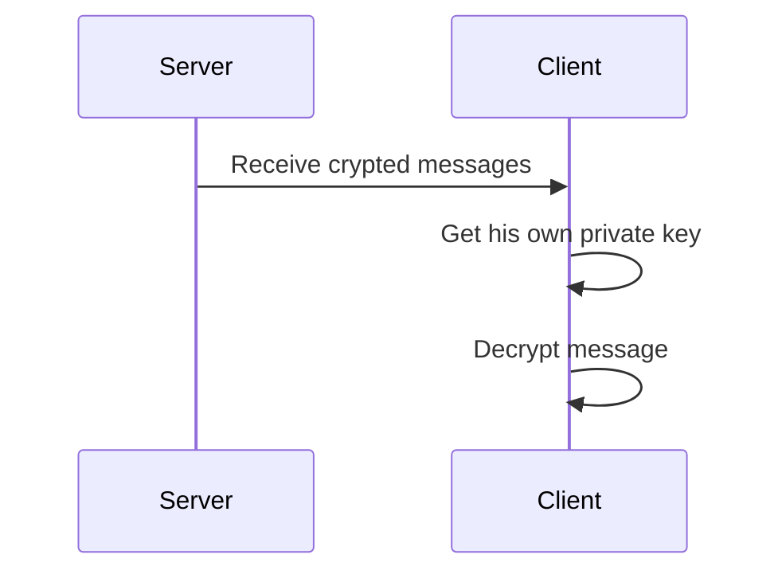
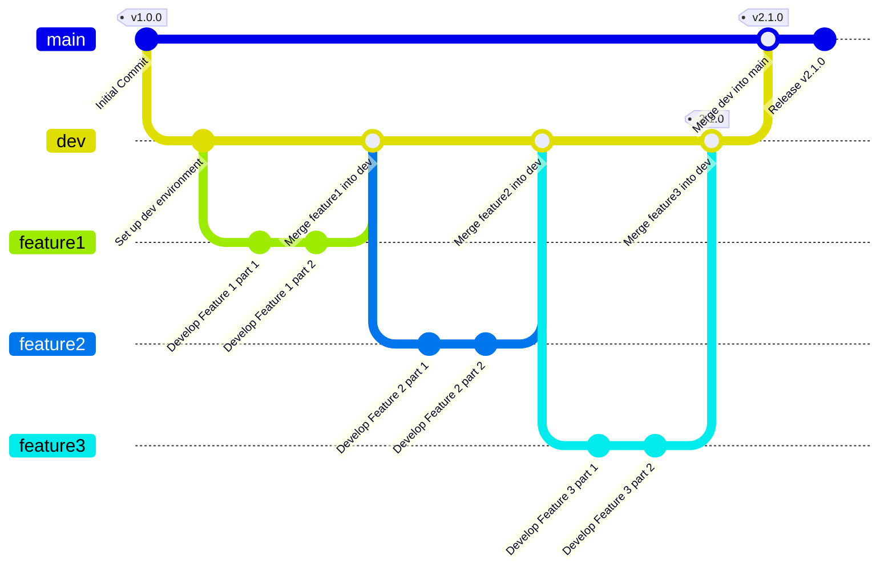

<sub><i>
AI-Generated and photoshopped logo
</i></sub>

# Secured Whisker 👨

[](https://github.com/yr72dpi/SecuredWhisker/actions/workflows/security-check-symfony.yml?query=branch%3Amain)
[](https://github.com/yr72dpi/SecuredWhisker/actions/workflows/security-check-go.yml?query=branch%3Amain)

This is a secure messaging application that allows users to send encrypted messages and files to each other, using RSA encryption on message and AES on file. The application ensures the security and privacy of communication by encrypting messages before transmission and decrypting them upon reception, even if there is no https.

<sub><i>
This is a one year school project but i would like to make it a real full project [See the subject](./docs/subject.md)
</i></sub>


## 📚 Documentation

- [🧭 Q&A Policy](./docs/Q&A_POLICY.md)
- [📜 RGPD Policy](./docs/RGPD.md)
<!-- - [🤝 Contributing Guidelines](./CONTRIBUTING.md) -->
<!-- - [🔐 Security Policy](./SECURITY.md) -->
<!-- - [🏗️ Technical Architecture](./ARCHITECTURE.md) -->

## Security 🔐

The will of this project is to allow user to exchange messages and files securely even if there is no https.

All messages are encrypted with the recipient's public rsa key before being sent and stored on the server. And the recipient decrypts it with his private key stored in his browser. Which is AES encrypted with his password.

About files, they will be encrypted in the browser in AES with a randomly generated or user-generated key.

## ⚠ Warning ⚠

The __RSA private key is stored in your browser__. If you clean up “Cookies and site data”, this key, which is used to decrypt messages, will be lost.


## Features 📜

- Login
- Sign up
- Add someone
- Send / receive message
- Translate messages (with chatGPT)

## How to use 🤔
### Configuration

```env
# SecuredWhisker
VERSION=0.0.0

# User manager (Symfony, PHP) 
APP_ENV="dev"

# Messages manager (Fiber, GO) 
SHOW_ONLY_ERROR=false

# File manager (GO)
# To complete

# Frontend
# To complete

# POSTGRES (docker container)
POSTGRES_DB=securedwhisker
POSTGRES_PASSWORD=securedwhisker
POSTGRES_USER=root
POSTGRES_PORT=5432
```

<!-- 

_// TODO: To details_

### Start
_// TODO: To complete_

-->

## Architecture 🕸



### When messages are translate



## Stack 👁‍🗨

- User management
    - Language: __PHP__
    - Framework: __Symfony__
    - ORM: __Doctrine__
    - Database: __PostgreSQL__

- Messages management
    - Language: __GO__
    <!-- - Framework: __Fiber__ -->
    - WebSocket: __Gorilla WebSocket__
    <!-- - ORM: __Go Redis__ -->
    <!-- - Database: __Redis__ -->

- Translator : [YR72dpi/TextManagerGPT](https://github.com/YR72dpi/TextManagerGPT)

- Frontend
    - Language: __TypeScript__
    - Framework: __NextJs__
    - WebSockets : __socket.io__
    - Encryption: __node-forge__
    - Saving on client : __Dexie.js__ (library for indexedDB )

All of that are Docker-_ized_

## How it works ⚙

### Sign up

On subscription form, enter pseudo, password.
These data will be encrypted with the public key of the User Service.

A tag will be generate like __pseudo#randomNumber__ like Discord. 
It gonna be used to add someone.

### Login

On login form, enter pseudo, password.
These data will be encrypted with the public key of the User Service and it will return a jwtToken.

### Sending Message



### Receive Message



## Git flow

When I release version 1.0.0, Git Flow should look like this. 



## Versioning

The versionning convention follow the [Semantic Versioning 2.0.0](https://semver.org/)

Given a version number MAJOR.MINOR.PATCH, increment the:

- __MAJOR__ version when you make incompatible API changes
- __MINOR__ version when you add functionality in a backward compatible manner
- __PATCH__ version when you make backward compatible bug fixes

Additional labels for pre-release and build metadata are available as extensions to the MAJOR.MINOR.PATCH format.

## ChangeLog

_This changelog will make sense after that version 1.0.0 will be released_

[Full changelog](./docs/changelog.md)

## Contributing

Contributions are welcome! Feel free to open issues or submit pull requests to contribute to the development of this application.

## To improve it

- 2FA
- Create groups
- React-native front
- Gateway if necessary
- Crypt private key on local storage in AES with the user password


## Support me 😘

<a href="http://buymeacoffee.com/yr72dpi">

</a>