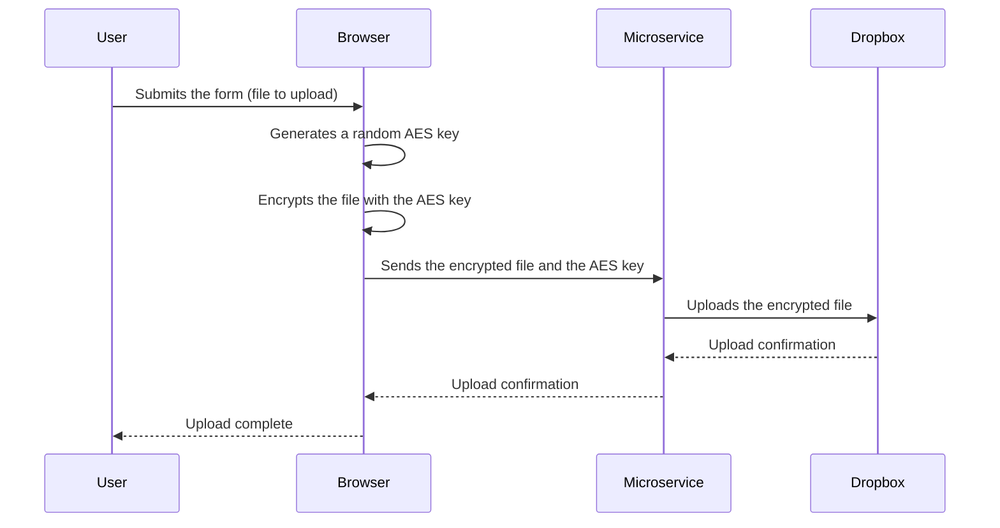

<sub><i>
AI-Generated and photoshopped logo
</i></sub>


# Secured Whisker 2.0

This is a secure messaging application that allows users to send encrypted messages and files to each other, using RSA encryption on message and AES on file. The application ensures the security and privacy of communication by encrypting messages before transmission and decrypting them upon reception, even if there is no https.

<sub><i>
This is a one year school project but i would like to make it a real full project_ [See the subject](./docs/subject.md)
</i></sub>

## ⚠ Warning ⚠
 
The RSA private key is stored in your browser. If you clean up “Cookies and site data”, this key, which is used to decrypt messages, gonna be lost.

_// To complete_

## Features

- Login
- Sign up
- Add someone
- Send / receive message
- Send file

## How to Run

// To complete...

## Architecture


## Stack

- User management
    - Language: __PHP__
    - Framework: __Symfony__
    - ORM: __Doctrine__
    - Database: __PostgreSQL__

- Messages management
    - Language: __GO__
    - Framework: __Fiber__
    - WebSocket: __Gorilla WebSocket__
    - ORM: __Go Redis__
    - Database: __Redis__

- File management
    - Language: __GO__
    - Upload : __github.com/chyroc/dropbox__

- Frontend
    - Language: __TypeScript__
    - Framework: __NextJs__
    - WebSockets : __socket.io__
    - Encryption: __JSEncrypt__ 🚨
    - Saving on client : __Dexie.js__ (library for indexedDB )

All of that are Docker-_ized_

## How it works

### Sign up

On subscription form, enter pseudo, password.

The password will be used to encrypt the private key in AES.

A tag will be generate like __pseudo#randomNumber__ like Discord. 
It gonna be used to add someone.

### Login

On login form, enter pseudo, password and 2FA code.

### Sending Message


### Receive Message


### Sending Files



### Download File

```Mermaid
sequenceDiagram
    participant Client
    participant Microservice
    participant Dropbox

    Client->>Microservice: Request to download file
    Microservice->>Dropbox: Retrieves the encrypted file
    Dropbox-->>Microservice: Sends the encrypted file
    Microservice-->>Client: Sends the encrypted file
    Client->>Client: Decrypts the file with the AES key
    Client->>Client: Uses the decrypted file
```
## Configuration

// To complete...

## Contributing

Contributions are welcome! Feel free to open issues or submit pull requests to contribute to the development of this application.

## To improve it

- Create groups
- 2FA
- React-native front
- Gateway if necessary
